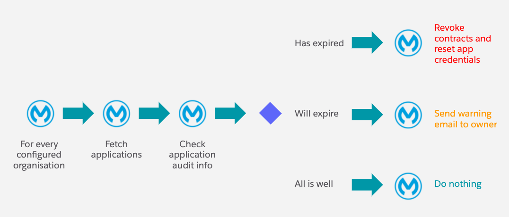
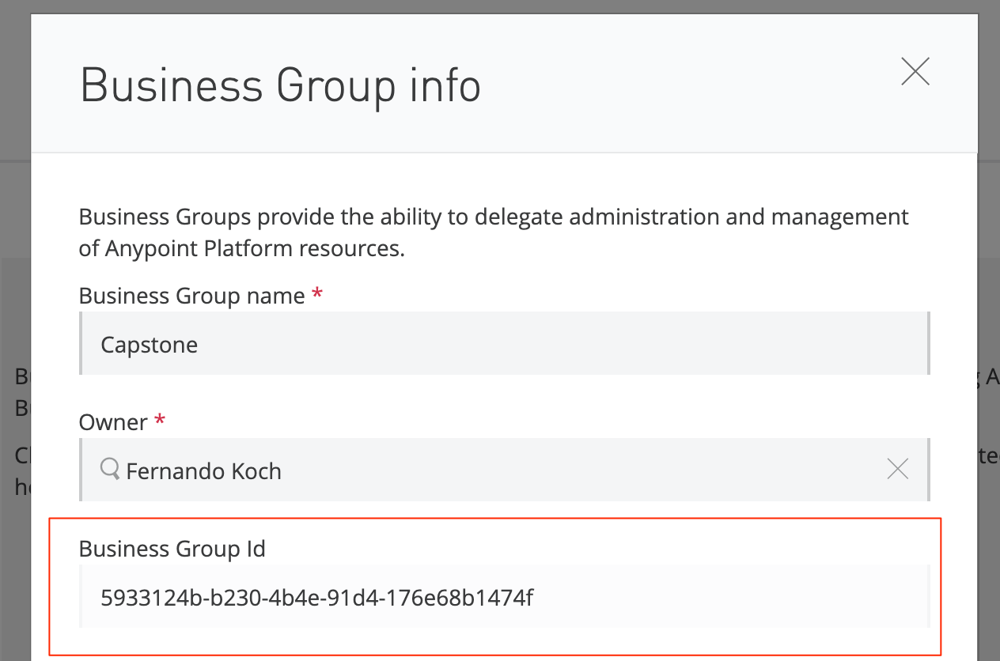
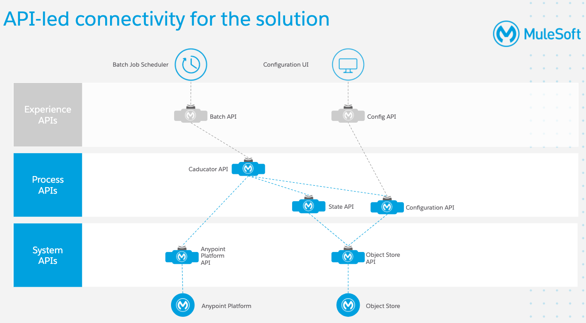

# Capstone Project: ACE

##   Automated Application Credential expiration


## Objective

One of the points often raised by customers is that credentials generated for client applications do not expire, which increases the risk of having them exposed to abuse by code that is no longer used. For this purpose, ACE can be used by customers to protect their APIs by having credentials automatically revoked after a certain period of time, which results in increased security.


## What does it do?

The idea behind ACE is the following: to check the applications in a specific organisation for their creation date and compare it to a configurable value in order to check if an application is close to the defined expiration period. If so, a warning email will be sent to the owner of the application to alert of a future expiration. After the warning period has passed, ACE will automatically revoke all contracts related to that application (and optionally remove them) and reset the application client credentials so it cannot longer be used.




### What happens when an application is about to expire?

* An email is sent to the application owner warning of the time left to create new credentials and update their applications with the new credentials - note that this time should be considerable
* A warning `flag` is stored in the object store if the email has been successfully sent so as to avoid retrying in the next run


### What happens when the application expires?

* First, all application contracts are revoked, which means the application does no longer have access to the APIs
* If the org configuration mandates, the contracts will also be deleted
* The App credentials are reset so as to invalidate them (the app is not deleted)
* An email is sent to the application owner (they will have received additional emails from the Anypoint Platform informing them of the contract revoke action)


## Triggering the main flow

A couple of trigger endpoints have been included to start the overall flow:

* `GET /start` triggers the main flow which will use the credentials stored in the project itself

* `POST /start` triggers the flow using the credentials passed in the body of the message. These take the form of

  ```json
  {
  	"username": "Anypoint username",
  	"password": "Anypoint password"
  }
  ```

  


## Configuration

The configuration is per organisation ID which can be retrieved from Access Management, as shown in the screenshot below. Having different configurations for various business groups allows flexibility in setting the SLAs, which might have different requirements.




The configuration values are the following:

| Key               | Description                                                  | Example                                |
| ----------------- | ------------------------------------------------------------ | -------------------------------------- |
| `organisationId`  | The ID of the organisation, as shown in the Anypoint Access Manangement | `5933124b-b230-4b4e-91d4-176e68b1474f` |
| `expiryDays`      | The amount of days to wait until an application expires      | `180`                                  |
| `warnDays`        | The amount of days in advance to send a warning - e.g.: 30 days before expiration | `30`                                   |
| `deleteContracts` | A flag to instruct whether contracts should be deleted once revoked or not | `false`                                |
| `contactEmail`    | A contact email address for application owners to reach out to in case they want their contracts restored | `someone@somewhere.com`                |


### Configuration Endpoints

Configurations can be created, updated and deleted using `REST` endpoints. The endpoint `/config` allows fetching, creating and deleting a configuration. To create a new configuration you need to send a `POST` with the following payload:

```json
{
    "configuration": {
        "organisationId": "5933124b-b230-4b4e-91d4-176e68b1474f",
        "expiryDays": 60,
        "warnDays": 30,
        "deleteContracts": false,
        "contactEmail": "fkoch@mulesoft.com"
    }
}
```


In turn, invoking `/config` with a `GET` request will return the configurations for the various organisations:

```json
{
  "organisations": [
    {
      "organisationId": "5933124b-b230-4b4e-91d4-176e68b1474f",
      "expiryDays": 60,
      "warnDays": 30,
      "deleteContracts": false,
      "contactEmail": "fkoch@mulesoft.com"
    }
  ]
}
```


Deleting an existing configuration is straightforward by invoking `/config/{org-id}` with a `DELETE` method.

Once ACE is configured the main flow can be triggered by invoking the `/start` endpoint in the main deployment - see the next section for implementation details.


## Implementation details

The project has been organised according to the following API-led diagram:




### Projects

There are 4 projects: 

* `capstone-ace-anypoint-api`: represents the system API of the Anypoint Platform, thus isolating the underlying platform
* `capstone-ace-state`: process API with specific methods for storing state related to emails
* `capstone-config`: a process API to store, fetch and delete configurations
* `capstone-impl`: a process API with the main execution flow and a trigger point


### Deployment

Deploying these 4 projects will require 4 workers which will consume 0.4 vCores, which is not ideal. Whilst the point of the Capstone project is to provide a proper project organisation and API-led example, this is not practical for customers. Therefore, a **single deployment project** is provided for customers wishing to deploy these in their on their own infrastructure: `capstone-ace-unified-impl`

The unified project also contains the endpoints for configuring the project.


## Appendix


### Secure properties

* https://docs.mulesoft.com/mule-runtime/4.3/secure-configuration-properties


### Salesforce Configuration UI

1. deploy package + create app. then drag & drop the component onto an Application  (or just d&d the component `AceConfig` in any page)
2. `Unauthorized endpoint, please check Setup->Security->Remote site settings. endpoint = http://<capstone-ace-config-endpoint>.cloudhub.io/api/config` => register endpoint
   * **Remote Site Name**: Capstone Ace Config API
   * **Remote Site URL**: `http://<capstone-ace-config-endpoint>.cloudhub.io/api/config`
   * Allow HTTP and HTTPS access (checkbox)